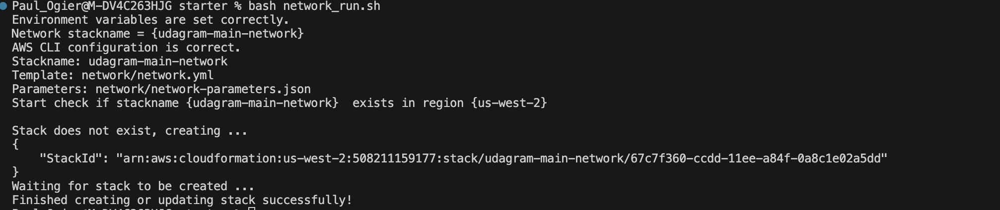
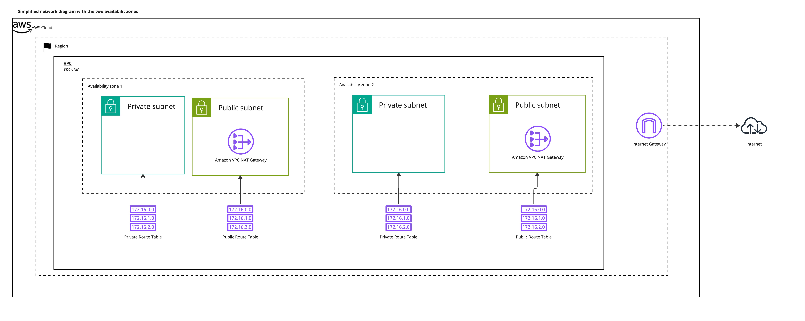
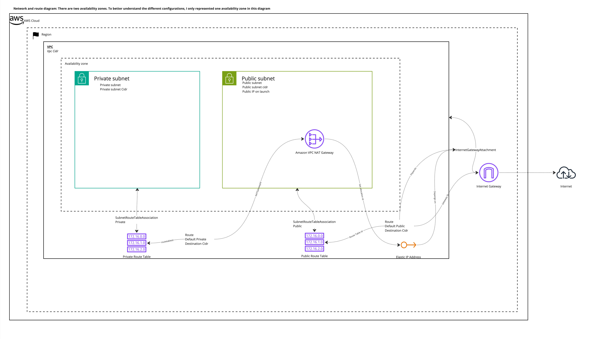

# CD12352 - Infrastructure as Code Project Solution
# Paul Ogier

## Spin up instructions - general
### Pre-requisites: Environment variables
* The AWS region is defined in your environment variables as `REGION`
  * This is useful to have a deployment across regions
* The stack name is defined as an environment variable `STACKNAME` 
* The environment (dev, stg, main) has been defined as an environment variabe `STACKENV`
* This calculate the stackname for network and servers, in lowercase:
  * `stackname-env-network` 
  * `stackname-env-servers`
  * example : `udacity-main-network`
* This allow for separating cleanly projects (by their namespace) and environments (from development to production)
* The AWS CLI has been configured
* You can test the configurations using the `test_pre_requisites.sh` script that will perform multiple tests to validate your set-up 
* Verify the parameters in `network/network-parameters.json` and `udagram/udagram-parameters.json`

### Using the run script
* The `run.sh` will create or update a stack
* It requires the following parameters, named or positional:
  * `stackname`
  * `template`
  * `parameters`
* Example: `bash run.sh mystackname network/network.yml network/network-parameters.json`
* It gives detailed explanations of what is happening

## As a network engineer
### Run
* Shortcut: make sure you have the environment variables sets and run `network_run.sh`

### Network description
The output of the `network.yml` template is:
* one VPC spanning two availability zones
* with one private and public subnet in each AZ
* One internet gateway 
* A NAT Gateway in each AZ's public subnet to allow the private subnet egress
* Associated route tables, elastic IPs

Network overview

Detailed network, with only one availability zone represented. This diagram is the output of the `network.yml` template

## Tear down instructions
* Use the `delete.sh` script with the parameter `stackname` to delete the stack you wish